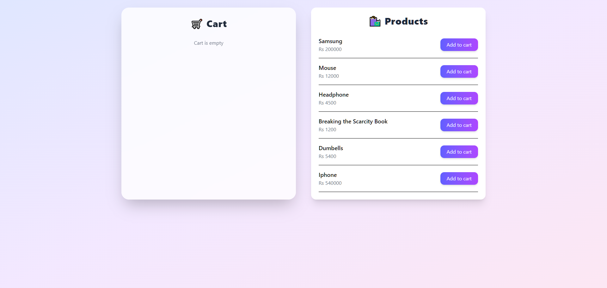

# React Cart App 🛒


A simple shopping cart application built with React and Tailwind CSS.

Users can browse products, add items to a cart, update quantities, remove products, and view the total price in real time.

---

## 🚀 Live Demo

https://react-cart-app-ruddy.vercel.app/

---

## 📸 Screenshot



---

## ✨ Features

- Add products to cart
- Increase or decrease product quantity
- Remove items from cart
- Automatic total price calculation
- Clean responsive UI
- Smooth hover animations
- Modern design using Tailwind CSS

---

## 🛠 Tech Stack

- React
- Vite
- Tailwind CSS
- JavaScript (ES6)

---

## 📂 Project Structure

```
src
├── components
│   ├── Cart.jsx
│   └── Products.jsx
│
├── App.jsx
├── main.jsx
├── App.css
└── index.css

public
└── screenshot.png
---

## ⚙️ Installation & Setup

Clone the repository

```bash
git clone https://github.com/MuqtasidBhatti/react-cart-app.git
```

Install dependencies

```bash
npm install
```

Run the development server

```bash
npm run dev
```

Open in browser

```
http://localhost:5173
```

---

## 📚 What I Practiced

- React state management
- Array methods (`map`, `filter`, `reduce`)
- Component based architecture
- Clean UI design with Tailwind
- Cart logic implementation

---

## 👨‍💻 Author

Muqtasid Bhatti

GitHub:  
https://github.com/MuqtasidBhatti

LinkedIn:  
https://linkedin.com/in/your-link

---

⭐ If you like this project, feel free to **star the repository**.
